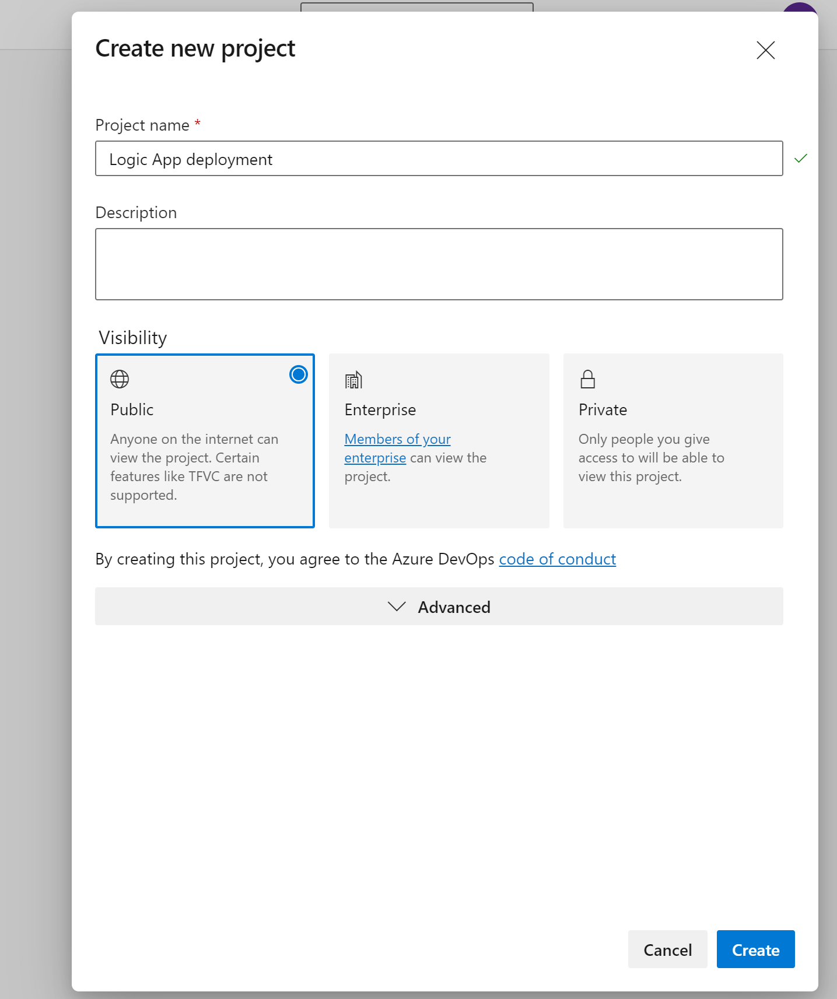

# Azure DevOps deployment for Logic App

This project provides examples on using Azure DevOps to create a CICD pipepline for deployment of Logic Apps, both consumption and standard versions. 

To create a pipeline, first we will need to create a new project in Azure devops

  

  
