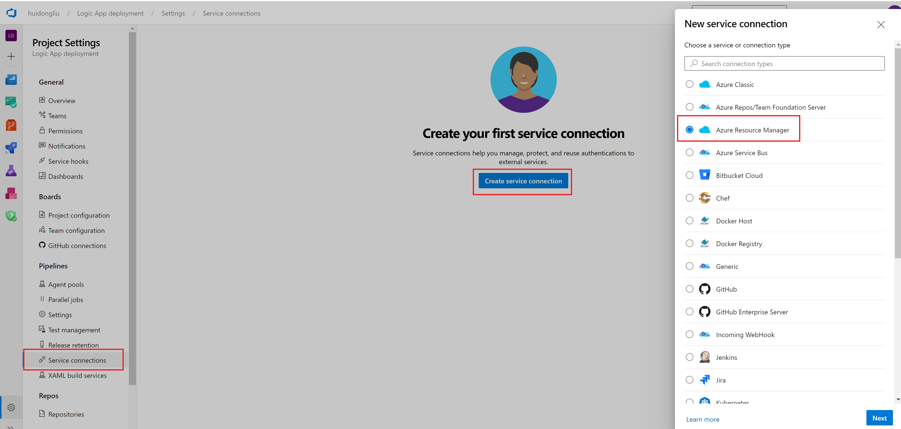

# Azure DevOps deployment for Logic App

This project provides examples on how to use Azure DevOps to create a CICD pipepline for deployment of Logic Apps, both consumption and standard versions. 

## Create a project
To create a pipeline, first we will need to create a new project in Azure devops

  

Once the project is created, we can goto the project-Repos, and import the code from github or git push code from existing repository. 
  

## Create a service connection
Before we create a pipeline, to deploy the logic app to your azure resource group, we will need to create a service connecition, by clicking the project settings:
  
  
Then goto the service connections, create service connection. Choose Azure Resource Manager
 
 
Choose the Service principal
  
 
Select the subscription and resource group you would like to connect as a resource, give the connection a name, and save. We are ready to use this service connection in the pipeline..
   
 
 
 ## Create a pipeline
Now We can go back to the projec and create a pipeline 
   
   
and choose the yml file in the repository and run the pipeline following the steps below   
   
